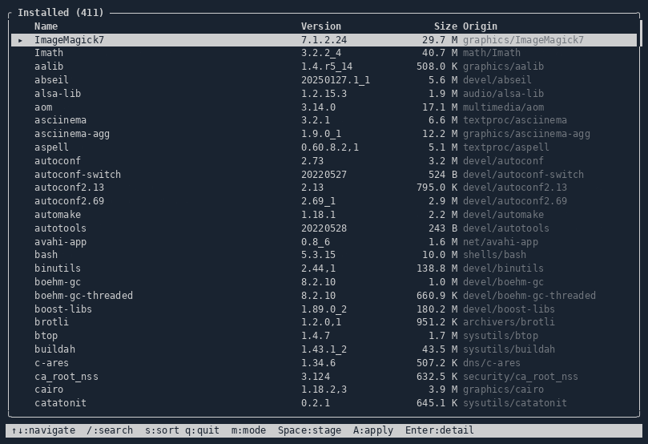

# pkgx

A terminal package browser for FreeBSD's `pkg(8)`.

Browse installed and available packages, inspect package details
(dependencies, dependents, shared-library users), and stage
installs/removals into a work list before applying them.



## Installation

```yaml
dependencies:
  pkgx:
    github: threez/pkgx # or path: ../pkgx for local development
```

Requires the `freebsd` shard (FreeBSD `pkg(8)` bindings) and `tui`
(this app's TUI library), both declared as `path:` dependencies in
`shard.yml` today since all three repos are developed side by side.

```sh
shards build
./bin/pkgx
```

## Usage

See [doc/usage.md](doc/usage.md) for the full keybinding reference.

## Architecture

See [doc/architecture.md](doc/architecture.md) for how `App`, `Browser`,
`WorkList`, the sources, and the widgets fit together, plus the
work-list panel's Window ↔ SplitWindow swap.

## Development

See [doc/development.md](doc/development.md) for build/spec commands and
how manual verification against a real `pkg` database works.

## Contributing

1. Fork it (<https://github.com/threez/pkgx/fork>)
2. Create your feature branch (`git checkout -b my-new-feature`)
3. Commit your changes (`git commit -am 'Add some feature'`)
4. Push to the branch (`git push origin my-new-feature`)
5. Create a new Pull Request

## Contributors

- [Vincent Landgraf](https://github.com/threez) - creator and maintainer
